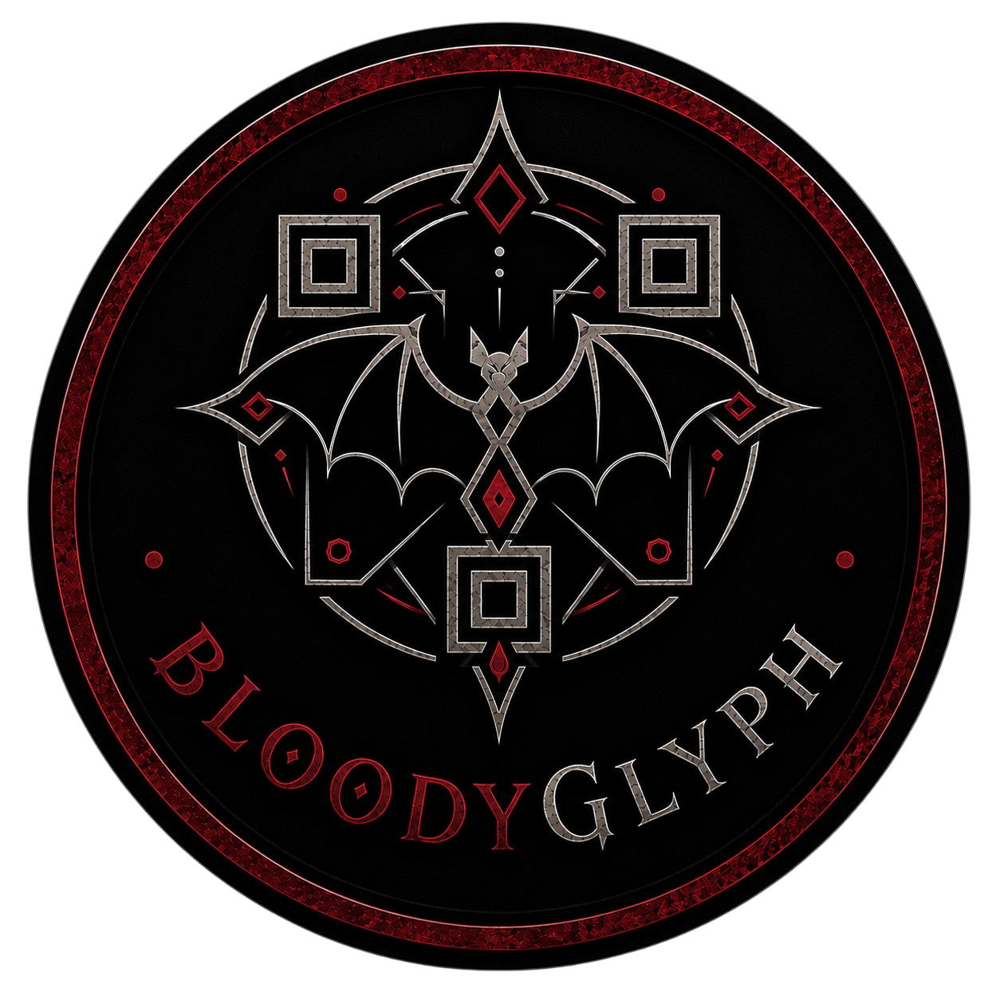
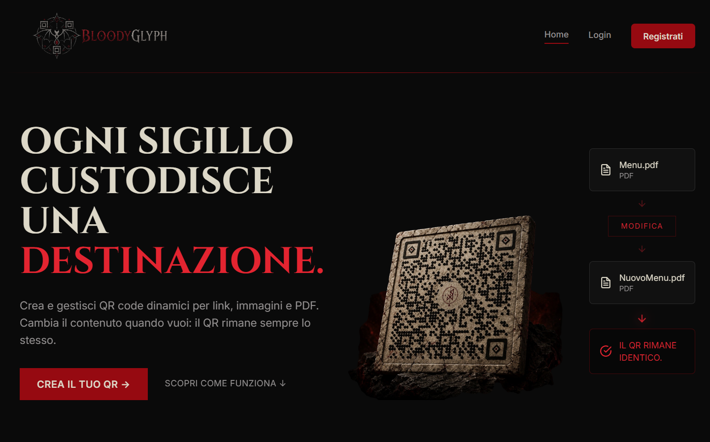
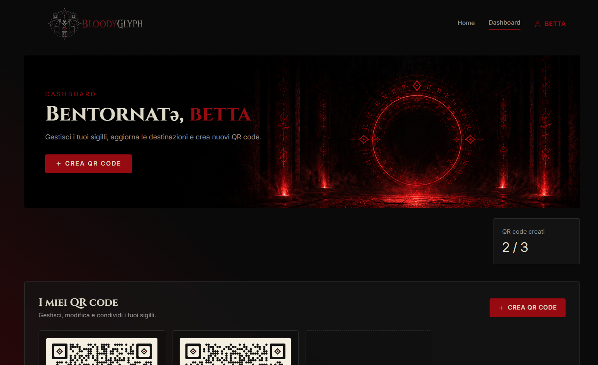
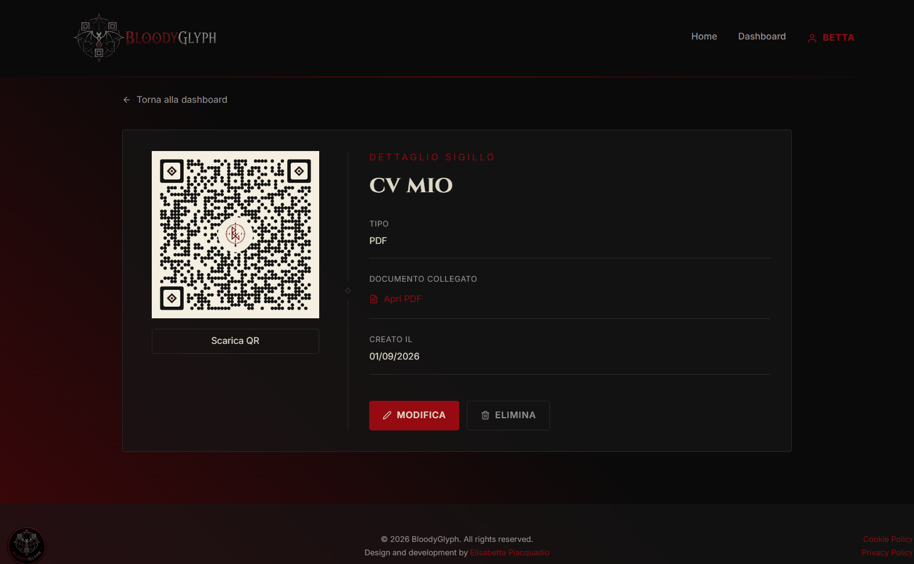

<div align="center">



# BLOODYGLYPH

### Ogni sigillo custodisce una destinazione.

Applicazione full-stack per creare e gestire **QR Code dinamici** associati a URL, immagini e documenti PDF.

[Live Demo](https://bloodyglyph.vercel.app/)

</div>

---

## About

**BloodyGlyph** è un progetto personale full-stack sviluppato per creare e gestire QR Code dinamici.

A differenza di un QR Code statico, il codice generato da BloodyGlyph non contiene direttamente la destinazione finale: punta a un endpoint pubblico del backend che gestisce il redirect.

Questo permette di **modificare successivamente URL, immagine o PDF associati mantenendo invariato lo stesso QR Code**.

Il progetto nasce come applicazione dimostrativa per mettere in pratica lo sviluppo di un'applicazione completa, dalla progettazione del database fino al deploy di frontend, backend e servizi cloud.

---

## Features

### QR Code

- Creazione di QR Code dinamici
- Supporto per **URL**
- Upload di **immagini**
- Upload di **documenti PDF**
- QR Code personalizzati generati tramite ZXing
- Redirect pubblico tramite codice univoco
- Modifica della destinazione senza rigenerare il QR
- Possibilità di cambiare il tipo di contenuto di un QR esistente
- Visualizzazione dettaglio
- Eliminazione del QR e degli asset associati
- Download del QR Code

### Account

- Registrazione
- Login
- Autenticazione tramite JWT
- Route private protette
- Recupero password tramite email
- Modifica delle impostazioni dell'account
- Eliminazione account

### Free tier

La versione attuale di BloodyGlyph è gratuita e consente la creazione di un massimo di **3 QR Code per account**.

---

## Tech Stack

### Frontend

- React
- Vite
- JavaScript
- Redux Toolkit
- React Router
- Tailwind CSS
- Framer Motion
- React Icons

### Backend

- Java
- Spring Boot
- Spring Security
- JWT Authentication
- Spring Data JPA
- ZXing
- BCrypt

### Database & Cloud

- PostgreSQL
- Neon
- Cloudinary
- Mailgun

### Deployment

- **Frontend:** Vercel
- **Backend:** Railway
- **Database:** Neon

---

## How dynamic QR Codes work

Quando viene creato un QR Code, BloodyGlyph genera un `publicCode` univoco.

Il QR non contiene direttamente l'URL, l'immagine o il PDF dell'utente, ma un indirizzo simile a:

```text
https://backend.example.com/q/{publicCode}
```

Quando il QR viene scansionato:

```text
QR Code
   │
   ▼
/q/{publicCode}
   │
   ▼
Spring Boot
   │
   ▼
Ricerca della destinazione corrente
   │
   ▼
HTTP Redirect
   │
   ▼
URL / IMAGE / PDF
```

La destinazione salvata nel database può quindi essere modificata senza cambiare il `publicCode`.

Di conseguenza **il QR Code fisico rimane lo stesso anche quando cambia il suo contenuto**.

---

## Screenshots

### Home



### Dashboard



### QR details



---

## Authentication & Security

BloodyGlyph utilizza un sistema di autenticazione stateless basato su **JWT**.

Il backend utilizza:

- Spring Security
- BCrypt per l'hashing delle password
- JWT per l'autenticazione
- controllo dell'ownership delle risorse
- endpoint protetti per le operazioni dell'utente

Il frontend utilizza route protette che impediscono l'accesso alle sezioni private in assenza di autenticazione.

Le autorizzazioni sulle risorse vengono comunque verificate dal **backend**, indipendentemente dai controlli effettuati dal frontend.

---

## Local Development

### Requirements

Per eseguire il progetto localmente sono necessari:

- Node.js
- npm
- Java
- Maven
- PostgreSQL

### Frontend

```bash
cd frontend
npm install
npm run dev
```

Il frontend utilizza una variabile d'ambiente per indicare l'URL del backend:

```env
VITE_API_URL=http://localhost:7001
```

### Backend

Avviare il backend Spring Boot tramite Maven o tramite il proprio IDE.

Esempio:

```bash
./mvnw spring-boot:run
```

Il server locale utilizza:

```text
http://localhost:7001
```

### Environment variables

Per motivi di sicurezza, credenziali, API key e secret **non sono inclusi nel repository**.

Per eseguire tutte le funzionalità sono necessarie variabili d'ambiente relative a:

- PostgreSQL
- JWT
- Cloudinary
- Mailgun
- configurazione URL frontend/backend

---

## API

Il backend espone API REST per:

- autenticazione
- utenti
- QR Code
- upload dei contenuti
- impostazioni account
- redirect pubblico dei QR

Durante lo sviluppo la documentazione delle API è disponibile tramite **Swagger / OpenAPI**.

---

## Project Status

**BloodyGlyph V1**

La prima versione comprende il flusso completo di:

```text
Registrazione
     ↓
Autenticazione
     ↓
Creazione QR
     ↓
Generazione QR dinamico
     ↓
Gestione / modifica
     ↓
Redirect pubblico
```

### Possible future developments

- gestione frontend delle categorie
- personalizzazione avanzata dei QR Code
- piano premium
- aumento dei limiti per account
- ulteriori opzioni di gestione dei contenuti

---

## Privacy

BloodyGlyph non utilizza strumenti pubblicitari o di profilazione.

La versione attuale non integra Google Analytics o altri sistemi di analytics comportamentali.

Sono disponibili direttamente nell'applicazione:

- Privacy Policy
- Cookie Policy

---

## Author

**Elisabetta Piacquadio**

Junior Full-Stack Developer

Design e sviluppo di BloodyGlyph realizzati come progetto personale.

---
